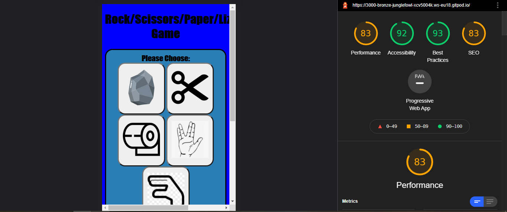

<h1 align="center">Rock/Scissors/Paper/Lizard/Spock Game</h1>

<h3>Rock, Paper, Scissors, Lizard, Spock is an expansion of Rock, Paper, Scissors created by Sam Kass and Karen Bryla . It was popularized by The Big Bang Theory TV series. Those traditional Rock, Paper, Scissors rules still apply, but two new options are added to the game: Lizard and Spock.<h3>
  
<h1>Overview</h1>
  <h3>The challenge was to build Rock, Paper, Scissors, Lizard, Spock game with using HTML, CSS and Javascript. The player can choose between the stone, scissors, paper, spock and the lizard. Computer automatically selects oe of the option. The results are displayed at the bottom of the board. The user can also start the new game.</h3>  
<h1>Structure</h1>
  <h3>The application is one page. There are 5 buttons with pictures for the player to choose from. Below is a table of choices and the result of the game. On a bottom of the page player can press button to start new game.</h3>
<h1>Testing</h2>
  <h3>Tested HTML, CSS and JS on the official validator services. No major issues found.</h3>
  
<h1>Deployment</h1>
  <h3>The project was deployed to GitHub Pages using the following steps...</h3>
   1. Log in to GitHub and locate the GitHub Repository 
   2. At the top of the Repository (not top of page), locate the "Settings" Button on the menu. 
   3. Scroll down the Settings page until you locate the "GitHub Pages" Section. 
   4. Under "Source", click the dropdown called "None" and select "Master Branch". 
   5. The page will automatically refresh.
    
<h1>Language used:</h1>
   1. HTML 
   2. CSS 
   3. Javascript 
    
<h1>Credits</h1>
 <h3>Pictures used for game buttons are from various open source sites. I view multiple sites for Javascript coding. Some open source codes significantly helped me building my game.</h3> 

  
  
